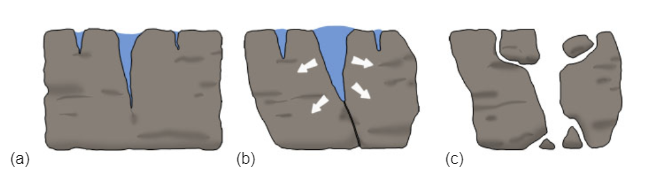
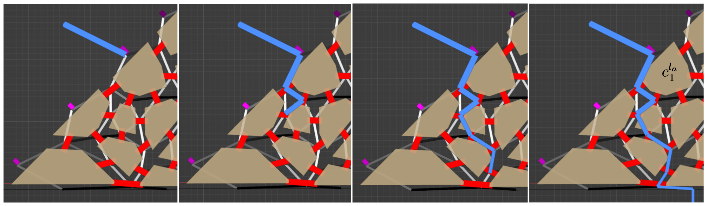
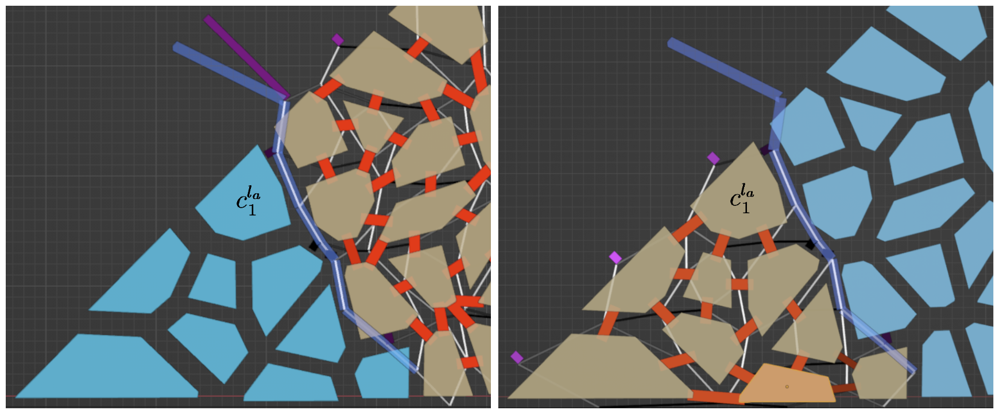
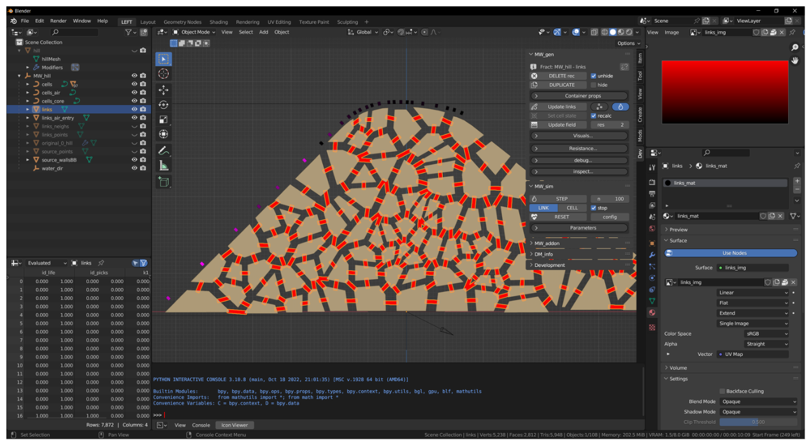
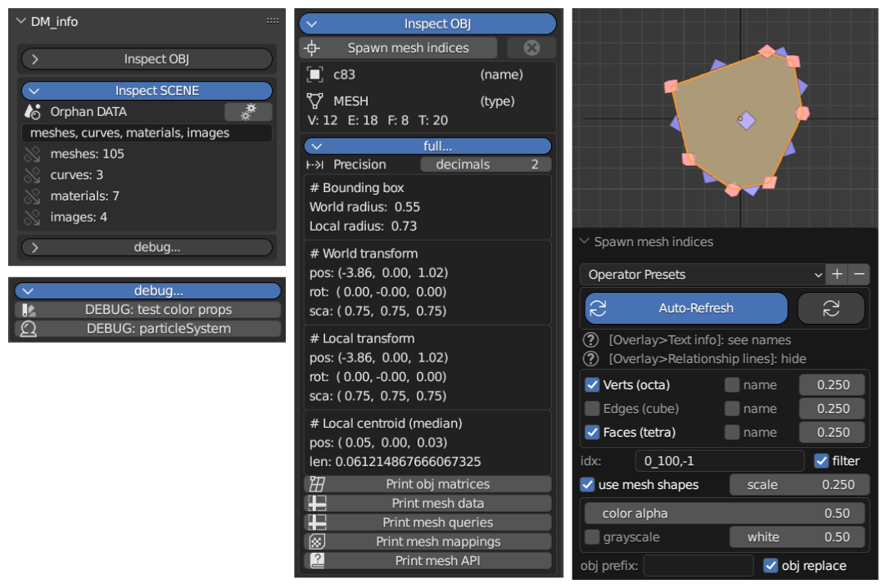
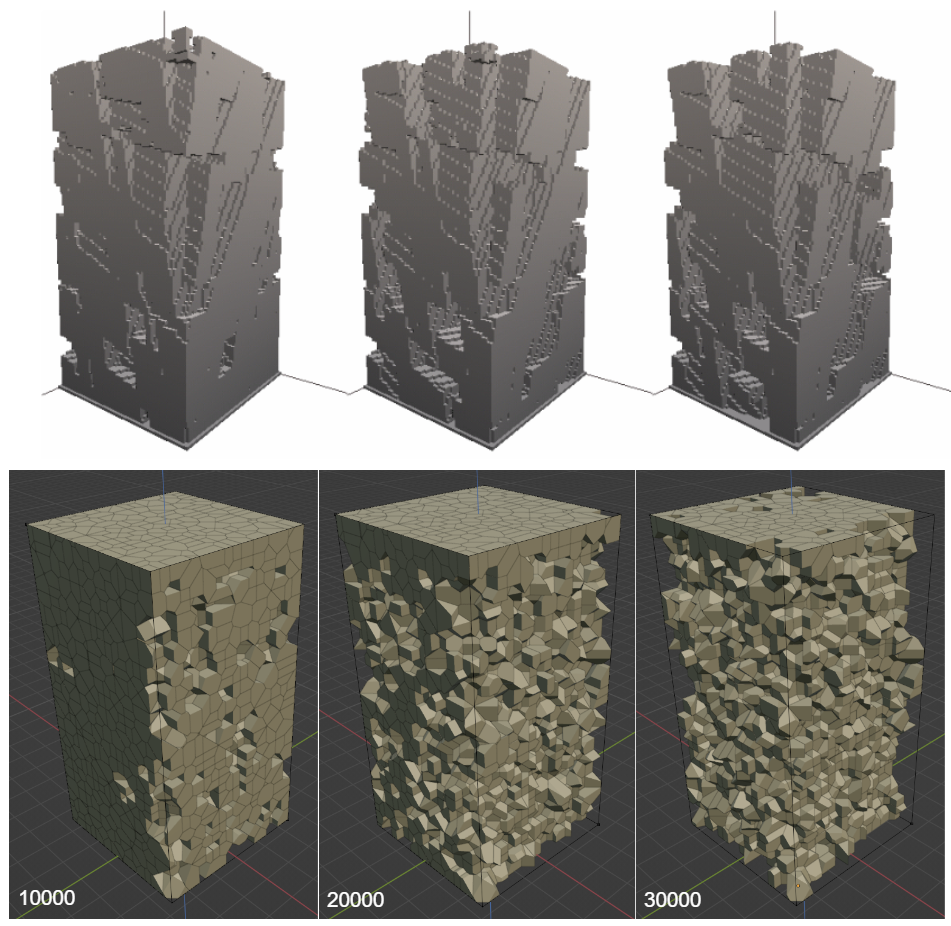
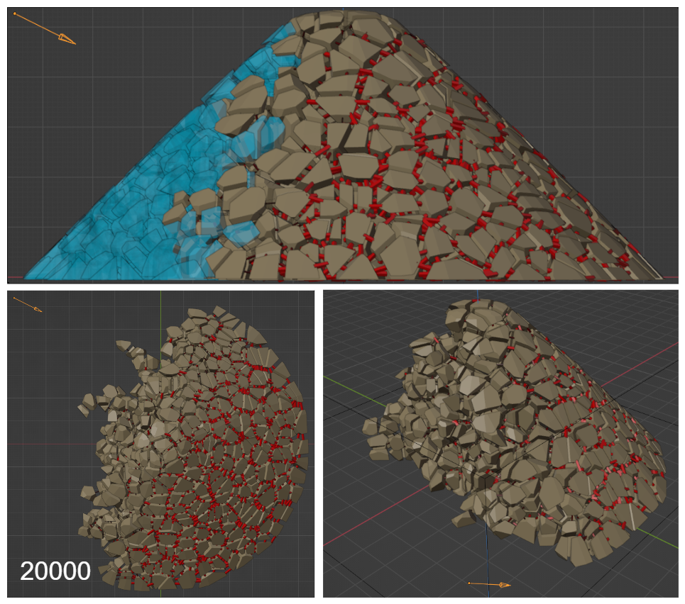

# UPC-MIRI-TFM

* DIEGO MATEOS ARLANZÓN diego.mateos@estudiantat.upc.edu

Thesis supervisors:
* OSCAR ARGUDO MEDRANO
* ANTONIO SUSIN SANCHEZ

> *Oral defence day*: **October 19, 2023** -> *Qualification*: **10**

# Simulation of mechanical weathering for modeling rocky terrains

Synthetic terrains play a vital role in various applications, including entertainment, training, and simulation. While significant progress has been made in terrain generation, existing methods often focus on large-scale features, relying on 2D elevation maps to model them. However, rocky terrains like those found in alpine environments have many detail features like sharp ridges, loose blocks or overhangs that are poorly represented in this maps, so it is common to model them using textures. 

Instead, in this project, we aim to generate plausible rocky geometry on top of existing 3D models. We propose a method based on a simplified simulation of mechanical erosion processes commonly found in high altitude terrains such as percolation and freeze-thaw weathering. The process can be controlled through a series of intuitive parameters and its iterative nature lets an artist apply it multiple times until sufficient erosion is achieved.

Additionally, we developed an artist-friendly tool integrated as add-on into Blender, which is a widely used 3D modeling software. This rich integration streamlines their workflow, eliminating the need for external applications and facilitating direct interaction with the model geometry before and after the simulated erosion.

## Keywords
* *Computer Graphics, 3D Modelling, Computer Simulation, Rocky Terrains, Mechanical Weathering.*

## References
* Not yet available in [UPCommons](https://upcommons.upc.edu/handle/2099.1/20414) library (*seems like they upload them only in June*)
* Complete bibliography accessible in [``references.bib``](https://github.com/dimateos/UPC-MIRI-TFM-erosion/blob/main/report/references.bib) (*the report section contains only cited ones*)

## *TODO*
* Report made public?
* Presentation too?
* Pictures contextualized in readme?
* More details on development?

> Feel free to contact me through email...

# Pictures

Detailed explanations available in the report...

> PDF documents available in the release page: https://github.com/dimateos/UPC-MIRI-TFM-erosion/releases

### Background

### Method

### Implementation

### Results

